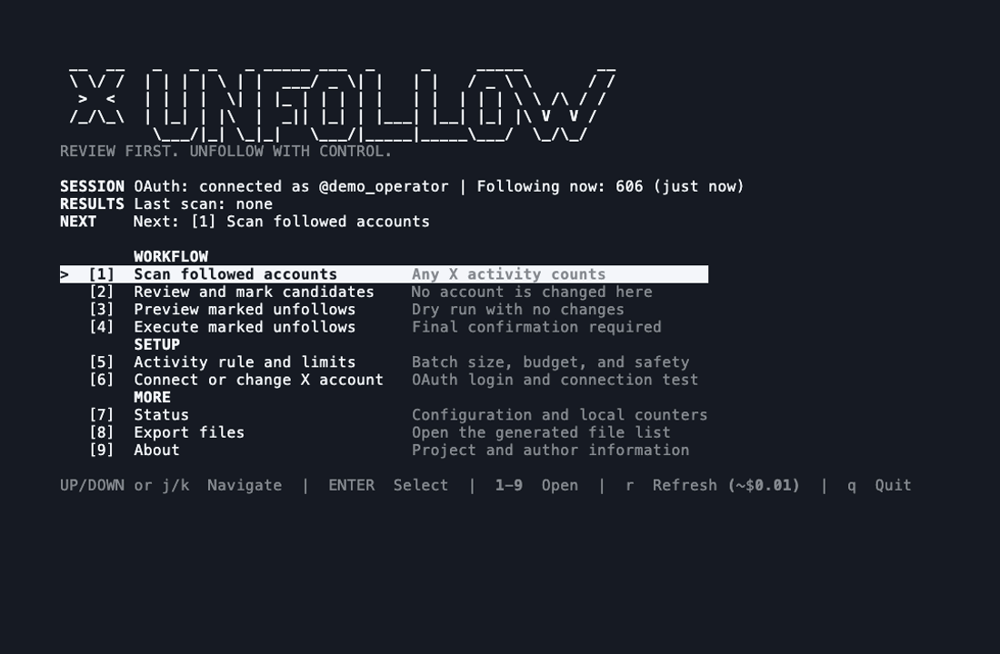

# X-Unfollow

A low-cost terminal app for finding, reviewing, and safely unfollowing inactive
X accounts through the official X API.



_The demo uses local sample data. It makes no X API requests and changes no
real account._

## What it does

- Finds inactive accounts without paid Post reads
- Uses your own inactivity rule, scan budget, and safety limits
- Lets you review and preview every unfollow
- Continues scans in batches and exports the results as CSV

Any X activity counts, including posts, replies, reposts, and quotes. There is
no scraping, browser automation, or AI deciding who to unfollow.

## Install

Requires macOS or Linux, Python 3.11+, an X Developer App, and X API credits.

```bash
git clone https://github.com/buhusa/x-unfollow.git
cd x-unfollow
./start.sh
```

The launcher installs everything locally and opens the interactive menu.

## Connect your X account

1. Open the [X Developer Console](https://console.x.com/).
2. Create an App and enable **OAuth 2.0**.
3. Select **Native App** and **Read and write** permissions.
4. Register this callback URL exactly:

   ```text
   http://127.0.0.1:8765/callback
   ```

5. Copy the OAuth 2.0 **Client ID** from **Keys and tokens**.
6. Start X-Unfollow and follow the guided login.

You only enter the Client ID. Access and refresh tokens are handled
automatically and stored locally.

## Add API credits

Open your account in [console.x.com](https://console.x.com/), add a payment
method, and purchase X API credits.

X Premium and `console.x.ai` credits do not include X API usage.

At the currently documented rates, scanning 1,000 accounts costs about `$1`:

```text
Authenticated User read       $0.010
1,000 owned Following reads   $1.000
Post reads                     $0.000
------------------------------------
Estimated total               $1.010
```

The app shows an estimate before every scan and blocks runs above your
configured budget. Always check the current
[X API pricing](https://docs.x.com/x-api/getting-started/pricing).

## Use the workflow

```text
1  Configure activity rule and limits
2  Scan followed accounts
3  Review and mark candidates
4  Preview marked unfollows
5  Execute after final confirmation
```

Opening the app and navigating the menu costs nothing. Pressing `r` refreshes
the current following count with one User read.

## Safety and privacy

Nothing is unfollowed during scanning or review. Real changes require fresh
scan evidence, an explicit mark, a preview, and final confirmation.

OAuth tokens, exports, and scan data remain in the Git-ignored `user-data/`
directory.

For batch behavior, exports, direct commands, and troubleshooting, see the
[detailed setup guide](docs/HOW_TO.md).

## About

Created by [@buhusa](https://x.com/buhusa) |
[buhussy.xyz](https://buhussy.xyz/)

[MIT License](LICENSE)
