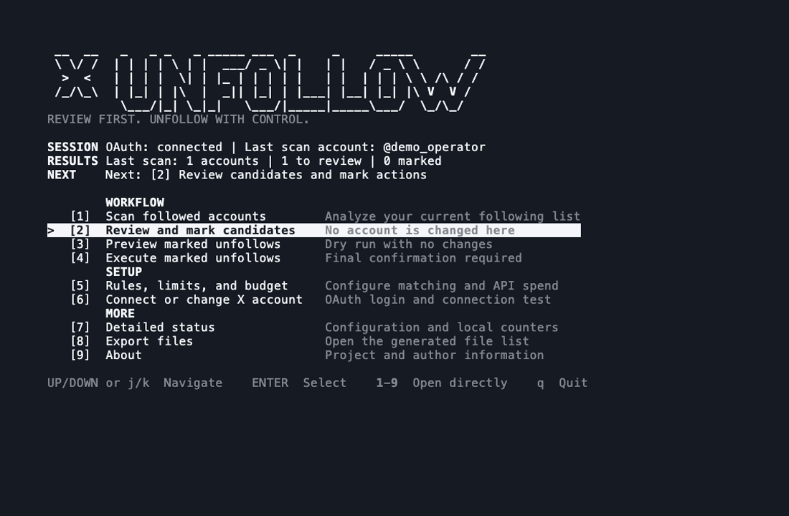

# X-Unfollow

A review-first terminal app for finding and unfollowing inactive X accounts
with the official X API.



## What it does

X-Unfollow:

- loads accounts you follow;
- checks their latest own posts and replies;
- applies inactivity rules you control;
- lets you review every candidate;
- previews changes before anything happens; and
- unfollows only accounts you explicitly marked and confirmed.

It uses deterministic Python code. There is no scraping, browser automation, or
LLM deciding who to unfollow.

## Requirements

- macOS or Linux
- Python 3.11 or newer
- an X Developer account and App
- X API credits

X Premium does not include X API usage. Credits at `console.x.ai` are also not
X API credits.

## 1. Download and start

```bash
git clone https://github.com/buhusa/x-unfollow.git
cd x-unfollow
./start.sh
```

The launcher creates a local Python environment, installs the app, and opens
the keyboard-controlled menu.

## 2. Create the X Developer App

1. Open the [X Developer Console](https://console.x.com/) and sign in.
2. Create an App or open an existing one.
3. Enable **OAuth 2.0** user authentication.
4. Choose **Native App** as the App type.
5. Enable **Read and write** permissions.
6. Add this callback URL exactly:

   ```text
   http://127.0.0.1:8765/callback
   ```

7. Save the settings.
8. Open **Keys and tokens** and copy the OAuth 2.0 **Client ID**.

On the first `./start.sh` launch, paste that Client ID into X-Unfollow. Your
browser opens so you can authorize the App.

You do **not** paste a Client Secret, access token, or refresh token. X-Unfollow
receives and stores the user tokens automatically after browser authorization.

Official references:
[X Developer Apps](https://docs.x.com/fundamentals/developer-apps) and
[OAuth 2.0 with PKCE](https://docs.x.com/fundamentals/authentication/oauth-2-0/user-access-token).

## 3. Add X API credits

The X API is pay per use:

1. Open [console.x.com](https://console.x.com/).
2. Select your Developer account.
3. Open its billing or credits area.
4. Add a payment method if requested.
5. Purchase X API credits.
6. Optionally configure auto-recharge and a spending limit.

The Developer Console shows the current balance and endpoint prices. X-Unfollow
shows a worst-case estimate before every paid scan and blocks scans above your
configured budget.

See the official [X API pricing page](https://docs.x.com/x-api/getting-started/pricing)
for current rates.

## 4. Use the workflow

```text
1  Scan followed accounts
2  Review and mark candidates
3  Preview marked unfollows
4  Execute marked unfollows
```

Use Up/Down or `j`/`k` to move, Enter to select, `1-9` for direct access, and
`q` to quit.

During review:

```text
u  mark for unfollow
k  keep
s  skip
o  show profile URL
q  leave review
```

Pressing `u` only creates a local mark. The real unfollow happens later in step
4 and always requires a separate confirmation.

## Settings and costs

Menu option `5` controls:

- own-post inactivity threshold;
- reply inactivity threshold;
- `and` or `or` rule matching;
- accounts and posts fetched per scan;
- hard maximum scan cost; and
- maximum unfollows per run.

The default rule requires no own post and no reply for 180 days.

X can change its pricing. Treat the estimate as a guardrail and the Developer
Console as the source of truth.

## Local data and privacy

When launched with `./start.sh`, private state stays in:

```text
x-unfollow/user-data/
```

This includes OAuth tokens, scan results, exports, and the unfollow audit log.
The entire directory is ignored by Git. Never upload it or paste its contents
into a public issue.

Successful unfollows are recorded locally in:

```text
user-data/data/unfollow_audit.jsonl
```

## Useful direct commands

```bash
.venv/bin/x-unfollow status
.venv/bin/x-unfollow check
.venv/bin/x-unfollow scan --limit 3
.venv/bin/x-unfollow review
.venv/bin/x-unfollow unfollow --dry-run
```

The interactive menu is recommended for normal use.

## Troubleshooting

**Callback URL error**

Use `http://127.0.0.1:8765/callback` exactly. Do not use `localhost` or add a
trailing slash.

**Payment or access error**

Check the X API balance and App status at `console.x.com`. Adding funds at
`console.x.ai` does not fund X API requests.

**Wrong X account**

Choose menu option `6` and authorize again while signed in to the intended X
account.

More details are available in [docs/HOW_TO.md](docs/HOW_TO.md).

## About

Created by [@buhusa](https://x.com/buhusa).

Website: [buhussy.xyz](https://buhussy.xyz/)

## License

[MIT](LICENSE)
